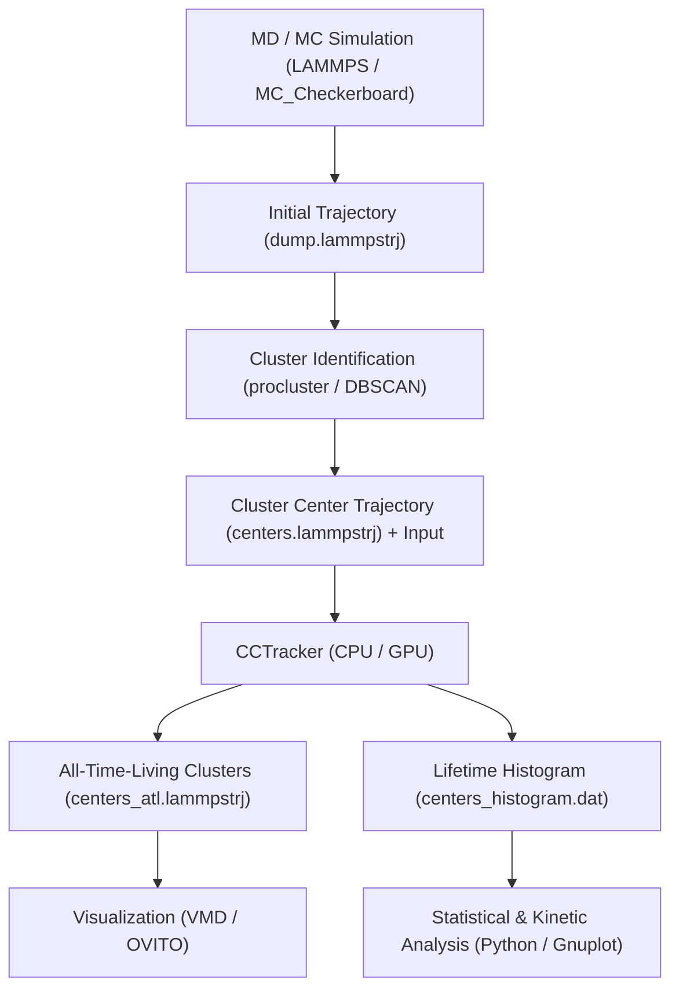

# CCTracker: GPU and CPU Tracking & Lifetime Analysis of Cluster Centers

**CCTracker** (**ClusterCenterTracker**) is a high-performance Fortran and CUDA Fortran tool for tracking cluster centers, evaluating cluster lifetimes, and isolating All-Time-Living (ATL) aggregates in Molecular Dynamics and Monte Carlo simulations.

## Authors

- **Antonio Díaz Pozuelo** - [adiaz@iqf.csic.es](mailto:adiaz@iqf.csic.es)
- **Enrique Lomba** - [enrique.lomba@csic.es](mailto:enrique.lomba@csic.es)

Instituto de Química Física Blas Cabrera (IQF-CSIC)  
**Date:** September 2026

---

## Overview

In molecular dynamics (MD) and Monte Carlo (MC) simulations of self-assembling systems (such as patchy colloids, protein condensates, micellar solutions, and phase-separating mixtures), clustering algorithms (e.g., DBSCAN, geometric connectivity, or `procluster`) identify clusters at discrete simulation snapshots and calculate their instantaneous center-of-mass coordinates (and velocities). 

However, standard simulation trajectory dumps (`centers.lammpstrj`) record cluster centers at each frame without persistent temporal particle identifiers. Consequently, tracking individual cluster histories, monitoring aggregate survival times, and distinguishing long-lived stable structures from transient fluctuations requires temporal trajectory reconstruction.

**CCTracker** (`cctracker`) provides a dedicated, high-performance computational pipeline implemented in both pure modern Fortran (CPU) and CUDA Fortran (GPU) that:
1. Reconstructs continuous cluster center trajectories across successive time frames under 3D periodic boundary conditions (minimum image convention).
2. Computes the global minimum pairwise distance between cluster centers to calibrate spatial proximity thresholds.
3. Automatically isolates **All-Time-Living (ATL)** clusters—aggregates that persist continuously across 100% of the simulation snapshots.
4. Generates statistical lifetime survival distributions (histograms) to analyze aggregation kinetics and cluster stability.
5. Exports reconstructed trajectories directly into standard LAMMPS trajectory format (`.lammpstrj`) for seamless visualization in VMD and OVITO.

### Note

- **Reduced Units:** Standard simulation units (e.g., Lennard-Jones reduced units or real units matching the original MD/MC trajectory) are preserved without transformation.
- **Periodic Boundary Conditions:** Orthogonal simulation boxes with periodic boundaries (`pp pp pp`) are assumed in all three Cartesian dimensions ($x, y, z$).
- **Distance Calibration:** A proximity adjustment factor ($\alpha_{\text{adj}} = 0.5$ by default) scales the calculated minimum inter-center distance to reliably map cluster identity across consecutive frames without hopping to neighboring aggregates.

### Key Features

- **Dual CPU & GPU Implementations:** Standalone pure Fortran 2008 implementation (`cpu/`) and massively parallel CUDA Fortran implementation (`gpu/`).
- **GPU Accelerated Distance Calculation:** Evaluates minimum pairwise distances across all simulation frames simultaneously using CUDA device kernels (`gpu_centers_min_distance<<<blocks, threads>>>`).
- **CUDA Managed Memory:** Utilizes unified/managed host-device memory (`managed` attribute) for zero-copy overhead and clean data coherence.
- **Periodic Boundary Handling:** Rigorous 3D minimum image convention for all distance calculations.
- **Temporal Trajectory Reconstruction:** Links cluster centers between consecutive time frames ($t_0 \to t_1$) with collision/duplicate assignment detection.
- **All-Time-Living (ATL) Extraction:** Isolates and extracts persistent cluster cores that survive throughout the entire simulation window.
- **Cluster Lifetime Histogramming:** Computes the probability distribution and frequency count of cluster survival durations.
- **LAMMPS Trajectory Output:** Direct generation of standard LAMMPS dump files containing coordinates and velocities for downstream analysis.

---

## System Requirements

### Hardware
- **CPU Version:** Any modern multi-core x86-64 processor.
- **GPU Version:** NVIDIA GPU with CUDA Compute Capability 3.0 or higher (tested on Tesla V100, A100, and RTX architectures).
- Minimum 2 GB of system RAM (larger trajectories may require additional memory).

### Software
- **Linux Operating System** (tested on CentOS/RHEL, Rocky Linux, and Ubuntu).
- **GNU Fortran compiler (`gfortran`)** version 8.0 or higher (for CPU compilation).
- **NVIDIA HPC SDK (`nvfortran`)** with CUDA Fortran support (formerly PGI compiler suite, for GPU compilation).
- **CUDA Toolkit** version 10.0 or higher.
- Optional: **VMD** or **OVITO** for trajectory visualization.

---

## Code Structure

### Root Directory
```text
.
├── README.md               # Project documentation
├── .gitignore              # Git ignore configuration
├── cpu/                    # Pure Fortran CPU implementation
│   ├── Makefile            # CPU compilation rules (gfortran)
│   ├── centers.f90         # Main CPU driver program
│   ├── common.f90          # mod_common: precision, data types, and shared arrays
│   ├── distances.f90       # mod_distances: CPU pairwise distance calculation
│   ├── io.f90              # mod_io: LAMMPS dump I/O and histogram export
│   └── trajectories.f90    # mod_trajectories: trajectory linking & lifetime analysis
└── gpu/                    # CUDA Fortran GPU implementation
    ├── Makefile            # GPU compilation rules (nvfortran)
    ├── centers.cuf         # Main CUDA Fortran driver program
    ├── common.cuf          # mod_common: CUDA execution grid & managed types
    ├── distances.cuf       # mod_distances: CUDA kernel & CPU reference routine
    ├── io.cuf              # mod_io: host-device I/O & LAMMPS dump writers
    └── trajectories.cuf    # mod_trajectories: GPU-threshold trajectory linking
```

### Module Descriptions

#### Core Modules
- **`mod_common` (`common.f90` / `common.cuf`):**  
  Centralizes data types and shared arrays. Defines single precision (`sp => real32`) and double precision (`dp => real64`), box dimensions (`low`, `high`, `side`, `side_div_2`), snapshot structures (`configuration` and CUDA `dev_configuration`), cluster tracking types (`center`), and lifetime accumulators (`clusters_time_life`, `clusters_time_steps`).
- **`mod_distances` (`distances.f90` / `distances.cuf`):**  
  Implements distance evaluation routines under periodic boundary conditions. In the GPU version, defines the CUDA global kernel `gpu_centers_min_distance<<<blocks, threads>>>` distributing snapshots across GPU threads to calculate minimum pairwise distances in parallel.
- **`mod_trajectories` (`trajectories.f90` / `trajectories.cuf`):**  
  Implements the temporal linking engine `cpu_trajectories_analysis()`. Maps cluster center positions at snapshot $t_0$ to matching candidates at $t_1$, tracks new cluster births, handles terminations, and sums lifetime histories.
- **`mod_io` (`io.f90` / `io.cuf`):**  
  Manages file reading and writing. Reads simulation control parameters (`Input`), parses input LAMMPS dump files (`centers.lammpstrj`), outputs All-Time-Living trajectories (`centers_atl.lammpstrj`), and exports cluster lifetime distribution histograms (`centers_histogram.dat` / `centers_atl_histogram.dat`).

---

## Compilation

### Compiling the CPU Version

The CPU code is written in standard Fortran 2008 and compiles with `gfortran`:

```bash
cd cpu
make clean
make build
```

This invokes:
```bash
gfortran -Ofast common.f90 distances.f90 io.f90 trajectories.f90 -o centers.exe centers.f90
```

To clean intermediate files (`*.mod`, `*.o`, `*.exe`):
```bash
make clean
```

### Compiling the GPU Version

The GPU code is written in CUDA Fortran and requires the NVIDIA HPC SDK (`nvfortran`):

```bash
cd gpu
make clean
make build
```

This invokes:
```bash
nvfortran -fast common.cuf distances.cuf trajectories.cuf io.cuf -o centers.exe centers.cuf
```

To target a specific GPU architecture, add the appropriate `-Mcuda` flag to `FCFLAGS` in `gpu/Makefile`:
- Tesla V100: `-Mcuda=cc70`
- Tesla A100: `-Mcuda=cc80`
- RTX 3090: `-Mcuda=cc86`
- Hopper H100: `-Mcuda=cc90`

### HPC Environment Setup (Example: CESGA)

On supercomputing clusters running environment modules (such as CESGA FinisTerrae):

```bash
# Load compiler and CUDA modules
module load cesga/2020 nvhpc/21.2
# Alternatively for GCC:
module load gcc/10.2.0
```

---

## Usage

### Required Input Files

The executable expects two input files in the working directory (or subdirectory specified in the driver program):

1. **`Input`**: Plain ASCII file containing a single integer indicating the total number of simulation snapshots to analyze:
   ```text
   1000
   ```
2. **`centers.lammpstrj`**: Standard LAMMPS trajectory file containing cluster center coordinates for each time step:
   ```text
   ITEM: TIMESTEP
   0
   ITEM: NUMBER OF ATOMS
   45
   ITEM: BOX BOUNDS pp pp pp
   0.0000000 50.0000000
   0.0000000 50.0000000
   0.0000000 50.0000000
   ITEM: ATOMS id type x y z vx vy vz
   1 1 12.345 23.456 34.567 0.01 -0.02 0.00
   ...
   ```

### Running the Analysis

```bash
# For CPU version:
cd cpu
./centers.exe

# For GPU version:
cd gpu
./centers.exe
```

---

## Output Files

1. **`centers_atl.lammpstrj`**:  
   Trajectory file in standard LAMMPS dump format containing exclusively the All-Time-Living (ATL) clusters that survived across all time steps ($t = 1 \dots \text{time\_steps}$). Ideal for direct visualization in VMD or OVITO:
   ```bash
   vmd centers_atl.lammpstrj
   ```
2. **`centers_histogram.dat` (CPU) / `centers_atl_histogram.dat` (GPU)**:  
   Two-column ASCII file reporting the cluster lifetime distribution:
   - Column 1: Lifetime duration / time bin upper bound ($\tau$).
   - Column 2: Frequency count of clusters that lived for that duration.
3. **Standard Output Log (`stdout`)**:  
   Displays detailed simulation progress metrics:
   ```text
   Simulation data:
   time_steps =        1000
   side =    50.00000    50.00000    50.00000
   min_n_centers =           12
   max_n_centers =           58
   *** GPU ***
   Processing minimal distances...
   cuda_n_threads =           64
   cuda_n_blocks =           16
   min_distance =    2.415829
   *** CPU ***
   Processing analysis of trajectories...
   Writing trajectories (life every time step): ./centers_atl.lammpstrj
   Writing life time histogram: ./centers_atl_histogram.dat
   n_clusters_atl =            5
   [% cluster_atl] (cluster_atl / clusters_proc) =   14.28
   ```

---

## Mathematical and Algorithmic Formulation

### 1. Periodic Distance & Minimum Image Convention

For an orthogonal simulation box of lengths $\mathbf{L} = (L_x, L_y, L_z)$ centered with boundaries $[x_{\text{low}}, x_{\text{high}}]$, the minimum image displacement vector $\Delta \mathbf{r} = (\Delta x, \Delta y, \Delta z)$ between two cluster centers $j$ and $k$ is calculated component-wise:

$$\Delta s = s_j - s_k, \quad s \in \{x, y, z\}$$

$$\Delta s_{\text{PBC}} = \begin{cases}
\Delta s - L_s & \text{if } \Delta s > \frac{L_s}{2} \\
\Delta s + L_s & \text{if } \Delta s < -\frac{L_s}{2} \\
\Delta s & \text{otherwise}
\end{cases}$$

The squared Euclidean distance under periodic boundary conditions is then:

$$r_{jk}^2 = \Delta x_{\text{PBC}}^2 + \Delta y_{\text{PBC}}^2 + \Delta z_{\text{PBC}}^2$$

### 2. CUDA Minimum Distance Evaluation (`gpu_centers_min_distance`)

To evaluate the minimum cluster separation across large trajectory ensembles efficiently, the GPU implementation maps simulation snapshots directly to CUDA threads:

$$\text{thread\_id} = (\text{blockidx\%x} - 1) \times \text{blockdim\%x} + \text{threadidx\%x}$$

Each active thread ($\text{thread\_id} \le \text{time\_steps}$) independently iterates over all unique pairs of cluster centers in snapshot $\text{thread\_id}$:

$$j \in [1, N_{\text{centers}} - 1], \quad k \in [j + 1, N_{\text{centers}}]$$

Threads execute conflict-free evaluations entirely in device memory, writing the local snapshot minimum to `dev_distances(thread_id)`. The host retrieves `dev_distances` and performs a reduction to determine the global minimum distance:

$$d_{\min} = \sqrt{\min_{t} \left\{ d_{\text{dev}}^2(t) \right\}}$$

### 3. Temporal Trajectory Linking

Given a distance cutoff threshold $d_{\text{cut}} = d_{\min} \cdot \alpha_{\text{adj}}$, cluster centers at consecutive frames $t_0$ and $t_1 = t_0 + 1$ are linked:
- For each active cluster trajectory $c$ at $t_0$ with position $\mathbf{r}_c(t_0)$, the candidate center $k$ at $t_1$ minimizing $r_{ck} < d_{\text{cut}}$ is assigned as the continuation of trajectory $c$:
  $$\mathbf{r}_c(t_1) = \mathbf{r}_k(t_1), \quad \mathbf{v}_c(t_1) = \mathbf{v}_k(t_1), \quad \Lambda(c, t_1) = 1$$
- If a candidate center has already been claimed by another cluster in the same time frame, the program detects the conflict and terminates safely.
- Unmatched cluster trajectories at $t_0$ are terminated and flagged with coordinates $(-1.0, -1.0, -1.0)$.
- Unmatched centers at $t_1$ are assigned new trajectory indices, representing newly nucleated clusters.

### 4. All-Time-Living (ATL) Classification & Lifetime Summation

The lifetime $\tau_c$ of cluster trajectory $c$ is the total number of frames in which it was actively identified:

$$\tau_c = \sum_{t=1}^{T} \Lambda(c, t)$$

A cluster is classified as an **All-Time-Living (ATL)** cluster if and only if:

$$\tau_c = T = \text{time\_steps}$$

The fraction of ATL clusters relative to the total number of distinct clusters processed $N_{\text{proc}}$ is:

$$\%_{\text{ATL}} = \left( \frac{N_{\text{ATL}}}{N_{\text{proc}}} \right) \times 100$$

---

## Typical Workflow



1. **Simulate:** Run molecular dynamics (LAMMPS) or Monte Carlo (e.g., `MC_Checkerboard`) simulations.
2. **Cluster Analysis:** Identify clusters using `procluster` or DBSCAN to produce `centers.lammpstrj`.
3. **Trajectory Tracking:** Run CCTracker (`./centers.exe` in `cpu/` or `gpu/`) to link cluster positions across frames and measure cluster lifetimes.
4. **Visualize & Analyze:** Load `centers_atl.lammpstrj` into VMD/OVITO to inspect persistent cluster cores, and plot `centers_histogram.dat` to assess aggregate stability.

---

## Performance Tips

- **CUDA Thread Configuration:** The GPU code defaults to `cuda_n_threads = 64` per block. For systems with large numbers of snapshots ($> 10^4$), tuning this value (e.g., 128 or 256) in `gpu/common.cuf` can improve warp occupancy.
- **Unified Memory:** The use of `managed` memory in `dev_configuration` simplifies memory transfers. Ensure your NVIDIA driver has unified memory support enabled.
- **Memory Scaling:** The parameter `max_3n_centers` dynamically scales memory to $10 \times \max(N_{\text{centers}})$, providing a generous headroom for cluster nucleation events.

---

## Citation & References

If you use this code in your research, please cite:

> Antonio Díaz Pozuelo and Enrique Lomba, *"CCTracker (ClusterCenterTracker): GPU and CPU Tracking & Lifetime Analysis of Cluster Centers for Molecular Dynamics and Monte Carlo Simulations"*, Instituto de Química Física Blas Cabrera, CSIC (2026).

### Related Methodological References
1. **LAMMPS Simulation Engine:**  
   A. P. Thompson et al., *"LAMMPS - a flexible simulation tool for particle-based materials modeling at the atomic, meso, and continuum scales"*, Computer Physics Communications, 271, 108171 (2022). DOI: [10.1016/j.cpc.2021.108171](https://doi.org/10.1016/j.cpc.2021.108171)
2. **GPU Monte Carlo & Clustering:**  
   J. A. Anderson et al., *"Massively parallel Monte Carlo for many-particle simulations on GPUs"*, Journal of Computational Physics, 254, 27–38 (2013). DOI: [10.1016/j.jcp.2013.07.023](https://doi.org/10.1016/j.jcp.2013.07.023)
3. **Colloidal Clustering & Phase Separation:**  
   I. Palaia and A. Šarić, *"Controlling cluster size in 2D phase-separating binary mixtures with specific interactions"*, The Journal of Chemical Physics, 156, 194902 (2022). DOI: [10.1063/5.0087769](https://doi.org/10.1063/5.0087769)

---

## License

This software is released under the **GNU General Public License Version 3 (GPLv3)**.

---

## Troubleshooting

### Common Issues

1. **`ERROR: centers limit reached, check max_3n_centers variable!`**  
   *Cause:* The number of newly nucleated clusters over the trajectory exceeded `max_3n_centers`.  
   *Solution:* Increase the factor in `cpu/io.f90` / `gpu/io.cuf` (`max_3n_centers = 20*max_n_centers`) and recompile.

2. **`ERROR: center processed again!`**  
   *Cause:* Two cluster centers at $t_0$ both mapped to the exact same center at $t_1$, violating one-to-one trajectory continuity.  
   *Solution:* Reduce the linking distance adjustment factor `distance_adj` (e.g. from 0.5 to 0.35) in the driver program.

3. **File Not Found (`Input` or `centers.lammpstrj`)**  
   *Cause:* The executable is looking for input files in a specific directory or the current working directory.  
   *Solution:* Ensure `Input` and `centers.lammpstrj` are present in the directory specified by the `directory` variable in `centers.f90` / `centers.cuf`.

---

## Getting Help

For questions, issues, or collaborations, please contact the authors:
- **Antonio Díaz Pozuelo**: [adiaz@iqf.csic.es](mailto:adiaz@iqf.csic.es)
- **Enrique Lomba**: [enrique.lomba@csic.es](mailto:enrique.lomba@csic.es)

---

## Acknowledgments

- Instituto de Química Física Blas Cabrera (IQF-CSIC).
- Computational resources provided by Centro de Supercomputación de Galicia (CESGA).

---

## Version History

- **V1.2 (September 2026):**
  - Standardized All-Time-Living (ATL) cluster extraction to standard LAMMPS dump format.
  - Added exact and binned lifetime histogramming export (`centers_histogram.dat` and `centers_atl_histogram.dat`).
  - Standardized research-grade headers and comprehensive documentation.
- **V1.1 (July 2026):**
  - Implemented CUDA Fortran parallelization (`gpu/`) for pairwise minimum distance evaluation (`gpu_centers_min_distance`).
  - Integrated CUDA managed memory (`dev_configuration`) for host-device coherence.
- **V1.0 (March 2026):**
  - Initial CPU implementation for reading LAMMPS dumps, computing minimum image distances, and tracking cluster trajectories across frames.
